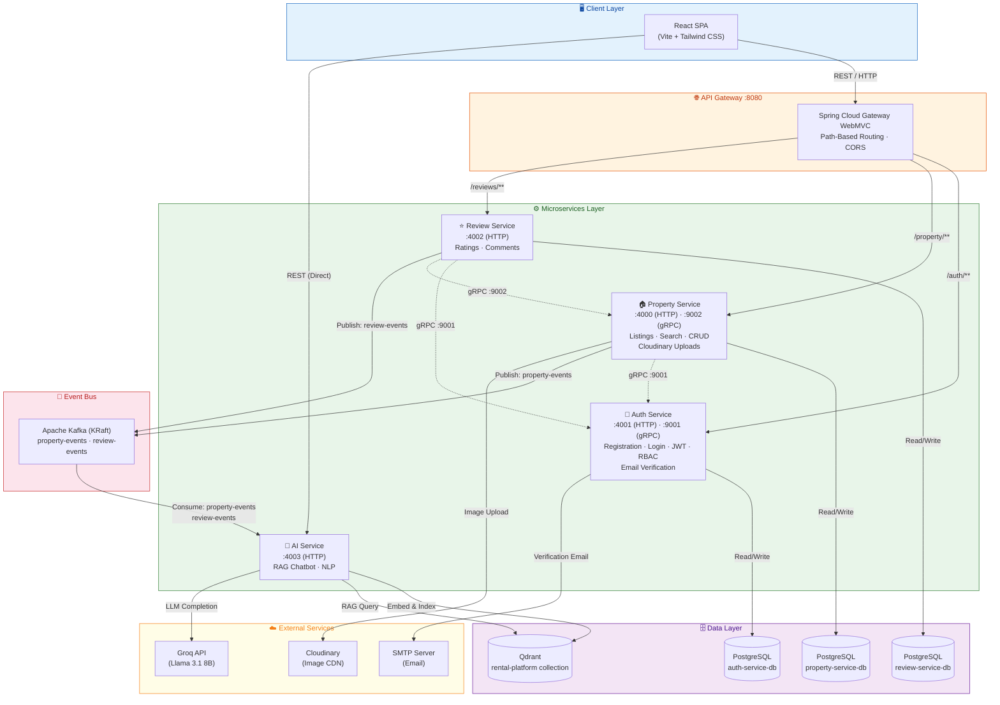
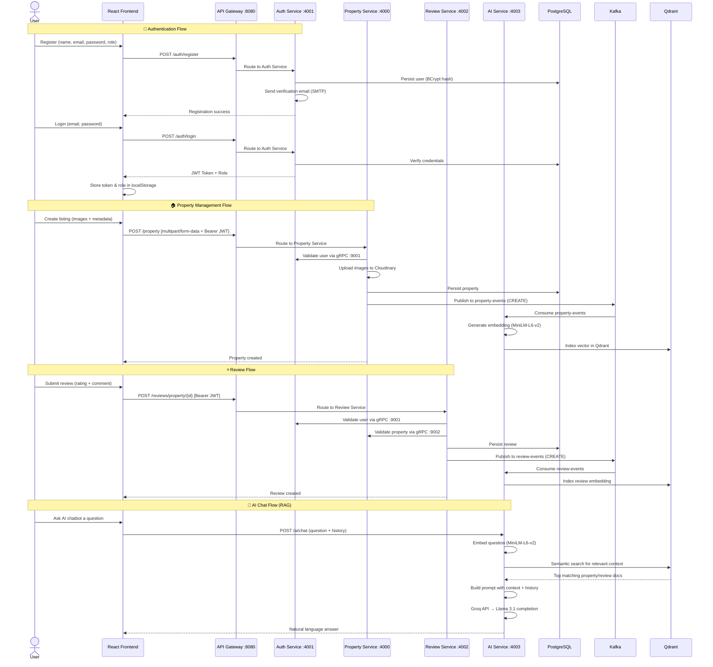

<div align="center">

# 🏠 CoRent — Smart Rental Platform

**A cloud-native, microservices-based rental management platform for streamlining property listings, tenant discovery, and end-to-end rental workflows.**

[](https://github.com/Kivindu02/smart-rental-platform/actions)
[](LICENSE)
[](https://openjdk.org/projects/jdk/21/)
[](https://spring.io/projects/spring-boot)
[](https://react.dev/)
[](https://www.python.org/)

</div>

---

## 📋 Project Overview

**CoRent** is a full-stack, production-ready smart rental management platform built on a **microservices architecture**. It enables property owners to list and manage rental properties, users to discover and review listings, and administrators to oversee the entire ecosystem — all through a modern, responsive web interface augmented by an AI-powered assistant with Retrieval-Augmented Generation (RAG).

The platform employs a **multi-protocol communication** strategy: REST APIs serve the frontend, **gRPC** handles synchronous inter-service calls, and **Apache Kafka** powers asynchronous event-driven workflows — including real-time AI knowledge-base indexing.

### Core Value Propositions

- **Decoupled Microservices** — Each domain (auth, properties, reviews, AI) runs as an independent service, enabling autonomous scaling and deployment.
- **Multi-Protocol Communication** — REST for clients, gRPC for low-latency inter-service calls, and Kafka for asynchronous event streaming.
- **RAG-Powered AI Assistant** — An integrated chatbot using Llama 3.1 (via Groq) with Qdrant vector search provides context-aware answers from live property and review data.
- **Role-Based Access Control** — Granular JWT-based authentication with three distinct user roles ensures secure, scoped access.
- **Cloud-Native & Kubernetes-Ready** — Full K8s manifests, Docker multi-stage builds, and CI/CD with automated Docker Hub pushes.

### User Roles

| Role | Capabilities |
|:-----|:-------------|
| **🔑 User (Tenant)** | Browse and search properties · Apply filters (type, price, location) · Submit and manage reviews · Chat with AI assistant |
| **🏘️ Owner (Landlord/Property Manager)** | Create, update, and manage property listings with image uploads · View owned properties · Track tenant reviews |
| **⚙️ Admin** | Full platform oversight · User management (view all, deactivate, delete) · Property & review moderation · Access to admin dashboard |

---

## 🛠️ Tech Stack

### Frontend

| Component | Technology | Version |
|:----------|:-----------|:--------|
| **UI Framework** | React | 19.2 |
| **Build Tool** | Vite | 8.0 |
| **Routing** | React Router DOM | 7.14 |
| **HTTP Client** | Axios | 1.18 |
| **Styling** | Tailwind CSS | 4.2 |
| **Linting** | ESLint | 9.39 |

### Backend Services (Java)

| Component | Technology | Version |
|:----------|:-----------|:--------|
| **Microservices Framework** | Spring Boot | 3.4 |
| **API Gateway** | Spring Cloud Gateway (WebMVC) | 2024.0.x |
| **Language Runtime** | Java (Eclipse Temurin) | 21 LTS |
| **ORM / Data Access** | Spring Data JPA / Hibernate | 6.x |
| **Validation** | Jakarta Bean Validation | 3.x |
| **Security** | Spring Security | 6.x |
| **Inter-Service RPC** | gRPC (grpc-spring-boot-starter) | Latest |
| **Serialization** | Protocol Buffers (protobuf-java) | Latest |
| **API Documentation** | SpringDoc OpenAPI (Swagger UI) | Latest |
| **Build Tool** | Apache Maven | 3.9 |

### AI Service (Python)

| Component | Technology | Purpose |
|:----------|:-----------|:--------|
| **Web Framework** | FastAPI + Uvicorn | REST API serving |
| **LLM Provider** | Groq SDK (Llama 3.1 8B Instant) | Natural language generation |
| **Embeddings** | sentence-transformers (all-MiniLM-L6-v2) | 384-dim text embedding |
| **Vector Database** | Qdrant | Similarity search for RAG |
| **Event Consumer** | kafka-python | Real-time knowledge indexing |
| **Validation** | Pydantic | Request/response models |

### Data & Messaging

| Component | Technology | Details |
|:----------|:-----------|:--------|
| **Database** | PostgreSQL 16 | 3 isolated instances (auth, property, review) |
| **Message Broker** | Apache Kafka (KRaft mode) | No Zookeeper dependency |
| **Vector Store** | Qdrant | `rental-platform` collection (384 dims, Cosine) |
| **Schema Management** | Hibernate Auto-DDL | `ddl-auto=update` |

### Security & Authentication

| Component | Technology | Details |
|:----------|:-----------|:--------|
| **Authentication** | JWT (JSON Web Tokens) | Stateless, HS-based signing |
| **JWT Library** | JJWT (io.jsonwebtoken) | 0.12.x |
| **Password Hashing** | BCrypt (Spring Security) | Adaptive hashing |
| **Email Verification** | Spring Boot Mail | Token-based account verification |
| **Session Policy** | Stateless | `SessionCreationPolicy.STATELESS` |

### Cloud & Media

| Component | Technology | Purpose |
|:----------|:-----------|:--------|
| **Image Storage** | Cloudinary | Property image upload, transform & CDN |
| **Email Delivery** | SMTP (Spring Mail) | Account verification emails |

### DevOps & Infrastructure

| Component | Technology | Details |
|:----------|:-----------|:--------|
| **Containerization** | Docker | Multi-stage builds (Maven builder → JRE runner) |
| **Orchestration** | Kubernetes | Full manifests with Secrets, Deployments, Services |
| **CI/CD** | GitHub Actions | Per-service pipelines with Docker Hub push |
| **Container Registry** | Docker Hub | `kivindu744/*` images |

---

## 🏗️ System Architecture & Data Flow



### Request Flow



---

## ✨ Key Features

### 🏠 Property Listing Management
- Full CRUD operations for rental properties with owner authorization
- Rich property attributes: name, description, price, address, type
- **Multi-image upload** via `multipart/form-data` with **Cloudinary** CDN storage and transformation
- Owner-only editing enforced via gRPC user validation
- Admin override for property moderation and deletion
- Property filtering by type and owner portfolio view (`/my-properties`)

### 🔍 Advanced Search & Discovery
- Browse all available property listings with rich detail pages
- Property detail view with **image gallery switcher**
- Recommended/featured listings on the homepage
- Filter and search capabilities across property metadata

### 🔐 Authentication & Role-Based Access
- Secure user registration with role selection (`USER` / `OWNER`)
- **Email verification** with time-limited tokens via SMTP
- JWT-based stateless authentication with BCrypt password hashing
- **Method-level security** with `@PreAuthorize` annotations (`isAuthenticated()`, `hasRole('ADMIN')`)
- Protected routes on the frontend with `ProtectedRoute` component
- User deactivation and soft-delete capabilities for admins

### ⭐ Review & Rating System
- Star-based rating system with **interactive `StarRating` component**
- Property-scoped reviews with per-property aggregation
- **Cross-service validation** — review service validates both user (via auth gRPC) and property (via property gRPC) before persisting
- Review ownership enforcement (edit/delete own reviews only)
- Admin moderation capabilities for review management

### 🤖 AI-Powered Chatbot (RAG)
- **Retrieval-Augmented Generation** — answers grounded in actual property and review data
- **Real-time knowledge indexing** — Kafka consumers automatically embed and index new properties and reviews into Qdrant as they are created, updated, or deleted
- **Semantic search** using `all-MiniLM-L6-v2` embeddings (384 dimensions, Cosine similarity)
- **LLM generation** via Groq API using `llama-3.1-8b-instant` model
- Multi-turn conversation support with chat history context
- Specialized system prompt for rental platform domain expertise

### ⚙️ Admin Dashboard
- **Centralized user management** — view all users, deactivate accounts, delete users
- **Property oversight** — view and remove any property listing across the platform
- **Review moderation** — view and delete any review
- **Dashboard statistics** — platform-wide metrics and summary
- Dedicated admin layout with sidebar navigation

### 🏗️ Microservices Architecture
- **Database-per-service** pattern with 3 isolated PostgreSQL instances
- **gRPC inter-service calls** for synchronous user and property validation
- **Kafka event streaming** for asynchronous workflows (property-events, review-events)
- **API Gateway** as single entry point with path-based routing and CORS
- **Independent deployability** — each service has its own Dockerfile, K8s manifest, and CI/CD pipeline
- **DTO & Mapper pattern** at API boundaries — entities never directly exposed

---

## ⚙️ Environment & Installation Setup

### Prerequisites

| Tool | Minimum Version | Purpose |
|:-----|:---------------|:--------|
| **Java JDK** | 21 | Backend microservices |
| **Maven** | 3.9+ | Java dependency management & builds |
| **Node.js** | 20+ | Frontend build tooling |
| **npm** | 10+ | Frontend package management |
| **Python** | 3.11+ | AI service |
| **PostgreSQL** | 16+ | Database |
| **Apache Kafka** | 3.x+ (KRaft) | Message broker |
| **Qdrant** | Latest | Vector database for RAG |
| **Docker** *(optional)* | 24+ | Containerized deployment |
| **kubectl** *(optional)* | 1.28+ | Kubernetes deployment |

### 1. Clone the Repository

```bash
git clone https://github.com/Kivindu02/smart-rental-platform.git
cd smart-rental-platform
```

### 2. Database Setup

Create three PostgreSQL databases (one per service):

```sql
CREATE DATABASE auth_db;
CREATE DATABASE property_db;
CREATE DATABASE review_db;
```

> [!NOTE]
> Hibernate is configured with `ddl-auto=update`, so tables and schemas are automatically created and updated on service startup. No manual migrations are needed.

### 3. Environment Variables Configuration

#### Auth Service

Configure in `auth-service/src/main/resources/application.properties` or via environment variables:

| Variable | Default | Description |
|:---------|:--------|:------------|
| `SPRING_DATASOURCE_URL` | `jdbc:postgresql://localhost:5432/auth_db` | PostgreSQL connection URL |
| `SPRING_DATASOURCE_USERNAME` | `postgres` | Database username |
| `SPRING_DATASOURCE_PASSWORD` | `password` | Database password |
| `JWT_SECRET` | *(configured in properties)* | JWT signing secret |
| `MAIL_HOST` | — | SMTP server hostname |
| `MAIL_PORT` | — | SMTP server port |
| `MAIL_USERNAME` | — | SMTP authentication username |
| `MAIL_PASSWORD` | — | SMTP authentication password |

#### Property Service

| Variable | Default | Description |
|:---------|:--------|:------------|
| `SPRING_DATASOURCE_URL` | `jdbc:postgresql://localhost:5432/property_db` | PostgreSQL connection URL |
| `SPRING_DATASOURCE_USERNAME` | `postgres` | Database username |
| `SPRING_DATASOURCE_PASSWORD` | `password` | Database password |
| `JWT_SECRET` | *(must match auth-service)* | JWT signing secret |
| `CLOUDINARY_CLOUD_NAME` | — | Cloudinary account cloud name |
| `CLOUDINARY_API_KEY` | — | Cloudinary API key |
| `CLOUDINARY_API_SECRET` | — | Cloudinary API secret |

#### Review Service

| Variable | Default | Description |
|:---------|:--------|:------------|
| `SPRING_DATASOURCE_URL` | `jdbc:postgresql://localhost:5432/review_db` | PostgreSQL connection URL |
| `SPRING_DATASOURCE_USERNAME` | `postgres` | Database username |
| `SPRING_DATASOURCE_PASSWORD` | `password` | Database password |
| `JWT_SECRET` | *(must match auth-service)* | JWT signing secret |

#### AI Service

Set these environment variables or create a `.env` file in the `ai-service/` directory:

| Variable | Description |
|:---------|:------------|
| `GROQ_API_KEY` | API key from [Groq Console](https://console.groq.com/) for Llama 3.1 inference |
| `QDRANT_HOST` | Qdrant server host (default: `localhost`) |
| `QDRANT_PORT` | Qdrant server port (default: `6333`) |
| `KAFKA_BOOTSTRAP_SERVERS` | Kafka broker address (default: `localhost:9092`) |

#### Frontend

The `.env` file in `frontend/` configures the API gateway URL:

```env
VITE_API_URL=http://localhost:8080
```

> [!IMPORTANT]
> The `JWT_SECRET` value **must be identical** across `auth-service`, `property-service`, and `review-service` for cross-service token validation to work correctly.

> [!WARNING]
> You must obtain API keys for **Cloudinary** (image uploads) and **Groq** (AI chat) before those features will function. The core property listing and auth flows work without them.

---

## 🚀 Local Development & Execution

### Step 1 — Start Infrastructure Services

Start PostgreSQL, Kafka, and Qdrant:

```bash
# PostgreSQL
docker run -d --name postgres \
  -e POSTGRES_USER=postgres \
  -e POSTGRES_PASSWORD=password \
  -p 5432:5432 \
  postgres:16

# Create databases
docker exec -it postgres psql -U postgres -c "CREATE DATABASE auth_db;"
docker exec -it postgres psql -U postgres -c "CREATE DATABASE property_db;"
docker exec -it postgres psql -U postgres -c "CREATE DATABASE review_db;"

# Kafka (KRaft mode — no Zookeeper required)
docker run -d --name kafka \
  -p 9092:9092 -p 9094:9094 \
  -e KAFKA_NODE_ID=1 \
  -e KAFKA_PROCESS_ROLES=broker,controller \
  -e KAFKA_LISTENERS=PLAINTEXT://0.0.0.0:9092,CONTROLLER://0.0.0.0:9093 \
  -e KAFKA_ADVERTISED_LISTENERS=PLAINTEXT://localhost:9092 \
  -e KAFKA_AUTO_CREATE_TOPICS_ENABLE=true \
  -e KAFKA_OFFSETS_TOPIC_REPLICATION_FACTOR=1 \
  -e KAFKA_CONTROLLER_QUORUM_VOTERS=1@localhost:9093 \
  -e KAFKA_CONTROLLER_LISTENER_NAMES=CONTROLLER \
  apache/kafka:latest

# Qdrant (Vector Database for AI RAG)
docker run -d --name qdrant \
  -p 6333:6333 -p 6334:6334 \
  qdrant/qdrant:latest
```

### Step 2 — Build & Run Backend Services

Open **four separate terminals** and run each service:

```bash
# Terminal 1: API Gateway (start first — port 8080)
cd api-gateway
./mvnw spring-boot:run

# Terminal 2: Auth Service (port 4001, gRPC port 9001)
cd auth-service
./mvnw spring-boot:run

# Terminal 3: Property Service (port 4000, gRPC port 9002)
cd property-service
./mvnw spring-boot:run

# Terminal 4: Review Service (port 4002)
cd review-service
./mvnw spring-boot:run
```

> [!TIP]
> On Windows, use `mvnw.cmd spring-boot:run` instead of `./mvnw spring-boot:run`.

### Step 3 — Run the AI Service

```bash
cd ai-service

# Create and activate virtual environment
python -m venv venv
source venv/bin/activate        # Linux/macOS
# venv\Scripts\activate         # Windows

# Install CPU-only PyTorch (required for sentence-transformers)
pip install torch --extra-index-url https://download.pytorch.org/whl/cpu

# Install dependencies
pip install -r requirements.txt

# Run the service (port 4003)
uvicorn app.main:app --host 0.0.0.0 --port 4003 --reload
```

> [!NOTE]
> On first startup, the AI service will download the `all-MiniLM-L6-v2` embedding model (~80MB). This is a one-time download.

### Step 4 — Launch the Frontend

```bash
cd frontend

# Install dependencies
npm install

# Start dev server
npm run dev
```

The application will be available at **http://localhost:5173** (Vite default).

### Service Endpoints Summary

| Service | HTTP Port | gRPC Port | Health / Docs |
|:--------|:----------|:----------|:--------------|
| **Frontend** | 5173 | — | — |
| **API Gateway** | 8080 | — | — |
| **Auth Service** | 4001 | 9001 | Swagger UI: `/swagger-ui.html` |
| **Property Service** | 4000 | 9002 | — |
| **Review Service** | 4002 | — | — |
| **AI Service** | 4003 | — | `/ai/health` |

### API Gateway Route Mapping

| Gateway Path | Routed To |
|:-------------|:----------|
| `/auth/**` | `http://auth-service:4001` |
| `/property/**` | `http://property-service:4000` |
| `/reviews/**` | `http://review-service:4002` |

---

## 🐳 Docker Deployment

Build and run all services using Docker:

```bash
# Build each service JAR first (from project root)
cd auth-service && ./mvnw clean package -DskipTests && cd ..
cd property-service && ./mvnw clean package -DskipTests && cd ..
cd review-service && ./mvnw clean package -DskipTests && cd ..
cd api-gateway && ./mvnw clean package -DskipTests && cd ..

# Build Docker images
docker build -t kivindu744/api-gateway ./api-gateway
docker build -t kivindu744/auth-service ./auth-service
docker build -t kivindu744/property-service ./property-service
docker build -t kivindu744/review-service ./review-service
docker build -t kivindu744/ai-service ./ai-service
```

> [!TIP]
> The Java Dockerfiles use **multi-stage builds** — the Maven builder stage compiles the code, then only the slim JRE runtime image (`eclipse-temurin:21-jre`) is used for the final container. The AI service pre-downloads the embedding model during the Docker build to avoid runtime downloads.

---

## ☸️ Kubernetes Deployment

Deploy the full platform to a Kubernetes cluster:

```bash
# Create namespace
kubectl apply -f k8s/namespace.yaml

# Deploy secrets (configure values in secrets.yaml first!)
kubectl apply -f k8s/secrets.yaml

# Deploy databases
kubectl apply -f k8s/postgres-auth.yaml
kubectl apply -f k8s/postgres-property.yaml
kubectl apply -f k8s/postgres-review.yaml

# Deploy Kafka (KRaft mode)
kubectl apply -f k8s/kafka.yaml

# Deploy application services
kubectl apply -f k8s/auth-service.yaml
kubectl apply -f k8s/property-service.yaml
kubectl apply -f k8s/review-service.yaml
kubectl apply -f k8s/api-gateway.yaml
```

The API Gateway is exposed via `NodePort` on port **30080**.

> [!IMPORTANT]
> Before deploying, update `k8s/secrets.yaml` with your base64-encoded credentials for: `JWT_SECRET`, `MAIL_*`, `CLOUDINARY_*`, and database passwords.

---

## 📁 Project Structure

```
smart-rental-platform/
├── api-gateway/                    # Spring Cloud Gateway — unified entry point
│   ├── src/main/resources/
│   │   └── application.yml         # Route definitions & CORS config
│   └── Dockerfile
│
├── auth-service/                   # User authentication & authorization
│   ├── src/main/java/.../
│   │   ├── controller/             # REST endpoints (register, login, verify, users)
│   │   ├── model/                  # User entity & Role enum (USER, OWNER, ADMIN)
│   │   ├── dto/                    # Request/Response DTOs
│   │   ├── repository/             # Spring Data JPA repositories
│   │   ├── service/                # Business logic, JWT, email verification
│   │   ├── security/               # Spring Security config & JWT filter
│   │   ├── grpc/                   # gRPC server implementation (:9001)
│   │   └── kafka/                  # Event producer
│   ├── src/main/proto/             # Protocol Buffer definitions
│   └── Dockerfile
│
├── property-service/               # Property listing management
│   ├── src/main/java/.../
│   │   ├── controller/             # CRUD, search, my-properties endpoints
│   │   ├── model/                  # Property entity (images, price, type)
│   │   ├── dto/                    # Request/Response DTOs
│   │   ├── mapper/                 # Entity ↔ DTO mappers
│   │   ├── repository/             # JPA repository
│   │   ├── service/                # Business logic, Cloudinary integration
│   │   ├── security/               # JWT validation filter
│   │   ├── grpc/                   # gRPC server (:9002) & client (→ auth :9001)
│   │   └── kafka/                  # Event producer (property-events)
│   ├── src/main/proto/             # Protocol Buffer definitions
│   └── Dockerfile
│
├── review-service/                 # Review & rating system
│   ├── src/main/java/.../
│   │   ├── controller/             # Review CRUD endpoints
│   │   ├── model/                  # Review entity (rating 1-5, comments)
│   │   ├── dto/                    # Request/Response DTOs
│   │   ├── repository/             # JPA repository
│   │   ├── service/                # Business logic & ownership checks
│   │   ├── security/               # JWT validation filter
│   │   ├── grpc/                   # gRPC clients (→ auth :9001, → property :9002)
│   │   └── kafka/                  # Event producer (review-events)
│   └── Dockerfile
│
├── ai-service/                     # AI chatbot with RAG (Python / FastAPI)
│   ├── app/
│   │   ├── main.py                 # FastAPI entry point
│   │   ├── routes/chat.py          # POST /ai/chat endpoint
│   │   ├── services/
│   │   │   ├── gemini_service.py   # Groq/Llama LLM integration
│   │   │   └── kafka_consumer.py   # Real-time Qdrant indexing from Kafka
│   │   └── models/chat.py          # Pydantic request/response schemas
│   ├── requirements.txt
│   └── Dockerfile
│
├── frontend/                       # React SPA (Vite + Tailwind CSS v4)
│   ├── src/
│   │   ├── components/             # Reusable UI components
│   │   │   ├── Admin/              # Admin layout (Nav, Sidebar, Footer)
│   │   │   ├── Hero/               # Landing page hero section
│   │   │   ├── Navbar/             # Main navigation bar
│   │   │   ├── PlaceCard/          # Property listing card
│   │   │   ├── ProtectedRoute/     # Auth-guarded route wrapper
│   │   │   ├── RecommendListings/  # Featured properties section
│   │   │   ├── Reviews/            # Review display components
│   │   │   ├── StarRating/         # Interactive star rating widget
│   │   │   └── Testimonials/       # User testimonials section
│   │   ├── pages/                  # Route-level page components
│   │   │   ├── Admin/              # Dashboard, AllUsers, AllProperties, AllReviews
│   │   │   ├── Auth/               # Login, Register
│   │   │   ├── Home/               # Landing page
│   │   │   ├── ListOwner/          # AddListing, AllListing (owner portal)
│   │   │   └── SpaceDetails/       # Property detail view
│   │   ├── context/                # React Context (AuthContext)
│   │   ├── services/               # API service modules (axios)
│   │   └── assets/                 # Static assets & images
│   ├── .env                        # VITE_API_URL config
│   └── package.json
│
├── k8s/                            # Kubernetes manifests
│   ├── namespace.yaml              # smart-rental namespace
│   ├── secrets.yaml                # JWT, mail, Cloudinary, DB credentials
│   ├── kafka.yaml                  # Kafka (KRaft mode) deployment
│   ├── postgres-auth.yaml          # Auth database deployment
│   ├── postgres-property.yaml      # Property database deployment
│   ├── postgres-review.yaml        # Review database deployment
│   ├── auth-service.yaml           # Auth service deployment (2 replicas)
│   ├── property-service.yaml       # Property service deployment (2 replicas)
│   ├── review-service.yaml         # Review service deployment
│   └── api-gateway.yaml            # Gateway deployment (NodePort 30080)
│
├── .github/workflows/              # CI/CD pipelines
│   ├── api-gateway.yml
│   ├── auth-service.yml
│   ├── property-service.yml
│   └── review-service.yml
│
├── LICENSE                         # MIT License
└── README.md                       # ← You are here
```

---

## 🔄 CI/CD Pipeline

Each microservice has its own **GitHub Actions workflow** that triggers on pushes and pull requests to `main` (scoped to that service's directory):

| Workflow | Trigger Scope | Steps |
|:---------|:-------------|:------|
| `auth-service.yml` | `auth-service/**` | JDK 21 setup → Maven test → Docker build → Push to Docker Hub |
| `property-service.yml` | `property-service/**` | JDK 21 setup → Maven test → Docker build → Push to Docker Hub |
| `review-service.yml` | `review-service/**` | JDK 21 setup → Maven test → Docker build → Push to Docker Hub |
| `api-gateway.yml` | `api-gateway/**` | JDK 21 setup → Maven test → Docker build → Push to Docker Hub |

**Docker images** are tagged with both `:latest` and `:${{ github.sha }}` and pushed to Docker Hub under the `kivindu744/` namespace.

> [!NOTE]
> Docker Hub push only runs on direct pushes to `main`. Pull requests only run the test step.

---

## 🗂️ API Reference

### Auth Service (`/auth`)

| Method | Endpoint | Description | Auth |
|:-------|:---------|:------------|:-----|
| `POST` | `/auth/register` | Register a new user | Public |
| `POST` | `/auth/login` | Authenticate & receive JWT | Public |
| `GET` | `/auth/verify` | Verify email token | Public |
| `GET` | `/auth/users` | List all users | Admin |
| `PUT` | `/auth/users/{id}/deactivate` | Deactivate a user | Admin |
| `DELETE` | `/auth/{id}` | Delete a user | Admin |

### Property Service (`/property`)

| Method | Endpoint | Description | Auth |
|:-------|:---------|:------------|:-----|
| `POST` | `/property` | Create listing (multipart) | Owner |
| `GET` | `/property` | List all properties | Public |
| `GET` | `/property/{id}` | Get property by ID | Public |
| `GET` | `/property/my-properties` | Get owner's properties | Owner |
| `GET` | `/property/ids` | Get properties by IDs | Internal |
| `PUT` | `/property/{id}` | Update listing (multipart) | Owner |
| `DELETE` | `/property/{id}` | Delete listing | Owner/Admin |

### Review Service (`/reviews`)

| Method | Endpoint | Description | Auth |
|:-------|:---------|:------------|:-----|
| `POST` | `/reviews/property/{propertyId}` | Create a review | Authenticated |
| `GET` | `/reviews` | List all reviews | Public |
| `GET` | `/reviews/property/{propertyId}` | Get reviews for a property | Public |
| `PUT` | `/reviews/{reviewId}` | Update a review | Owner |
| `DELETE` | `/reviews/{reviewId}` | Delete a review | Owner/Admin |

### AI Service (`/ai`)

| Method | Endpoint | Description | Auth |
|:-------|:---------|:------------|:-----|
| `POST` | `/ai/chat` | Send chat message (RAG) | Public |
| `GET` | `/ai/health` | Health check | Public |

---

## 📄 License

This project is licensed under the **MIT License** — see the [LICENSE](LICENSE) file for details.

© 2026 Kivindu Rajamanukula

---

<div align="center">

**Built with ❤️ using Spring Boot · React · FastAPI · gRPC · Kafka · Qdrant · Kubernetes**

</div>
